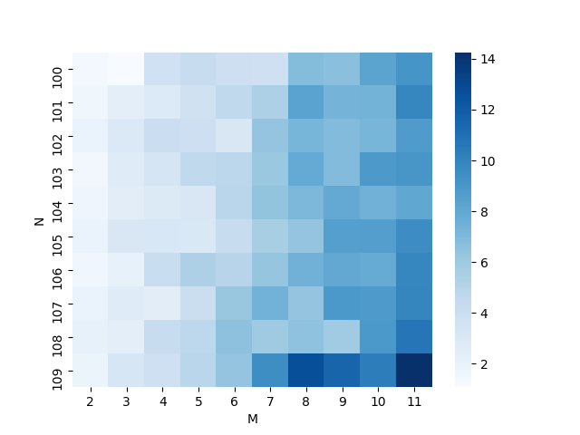

N = Number of samples (Rows)
M = Number of attributes or features
D = Depth of the tree
For discrete inputs, 
Let total number of classes be C.
# Case 1 : Real Input and Real Output
The graph of Fitting is:

The theoretical time analysis of Fitting is:
O(2^D*(MN^2))

The graph of Predicting is:

The theoretical time analysis of Predicting is:
O(D)

# Case 2 : Discrete Input and Real Output
The graph of Fitting is:

The theoretical time analysis of Fitting is:
O(C^D*(M*N))

The graph of Predicting is:

The theoretical time analysis of Predicting is:
O(D)

# Case 3 : Discrete Input and Discrete Output
The graph of Fitting is:

The theoretical time analysis of Fitting is:
O(C^D*(M*N))

The graph of Predicting is:

The theoretical time analysis of Predicting is:
O(D)

# Case 4 : Real Input and Discrete Output
The graph of Fitting is:

The theoretical time analysis of Fitting is:
O(2^D*(MN^2))

The graph of Predicting is:

The theoretical time analysis of Predicting is:
O(D)

