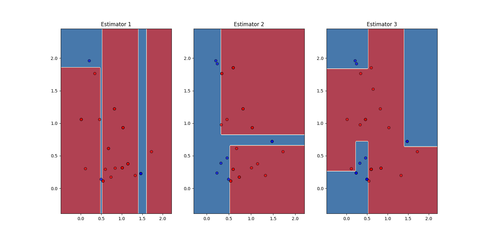
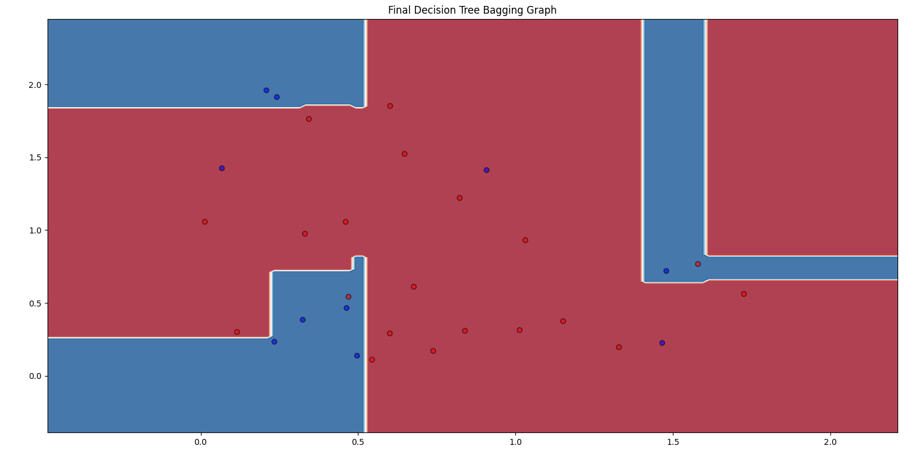

On Implement Bagging(BaseModel, num_estimators) where base model is be DecisionTree, following are Results of Bagging:
Criteria : entropy
Accuracy:  0.8333333333333334
Precision:  0.7777777777777778
Recall:  0.7
Precision:  0.8571428571428571
Recall:  0.9

